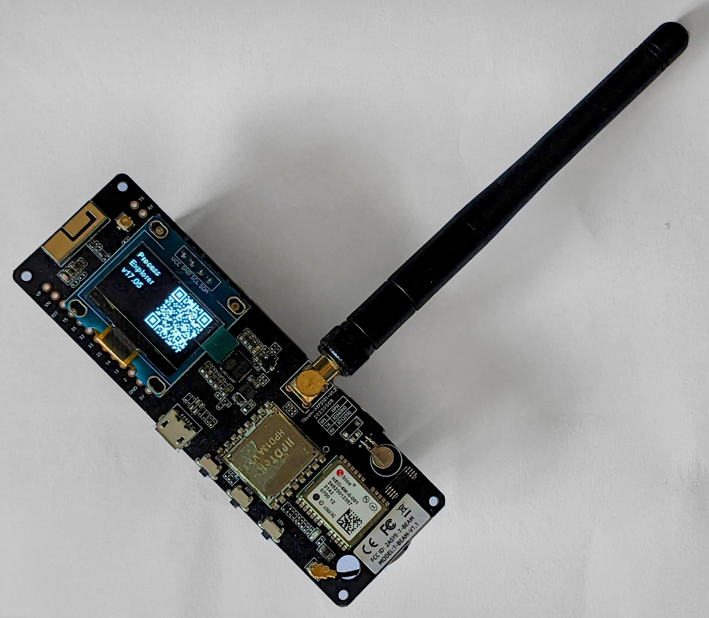

# Micronews

Micronews lets you browse hackernews with an esp32 and an oled screen.
It fetches new stories via the API and shows the title and a qrcode of the URL on the screen.

## Requirements

- ESP32 board
- OLED screen (SSD1306)
- Button
- Wi-Fi network
- PlatformIO IDE or VSCode with PlatformIO extension installed
- Libraries: WiFi, HTTPClient, SSD1306Wire, ArduinoJson, qrcode

## Installation

1. Clone or download the project from GitHub.
2. Open the project in PlatformIO IDE or VSCode with PlatformIO extension installed.
3. Install the required libraries using the Library Manager in the PlatformIO IDE or VSCode.
4. Connect the ESP32 board and OLED screen to your computer.
5. Set the Wi-Fi network name and password in the `ssid` and `password` variables in the `main.cpp` file.
6. Upload the code to the ESP32 board.
7. Use the button to navigate through the list of stories and view the title and URL of each story on the OLED screen.
